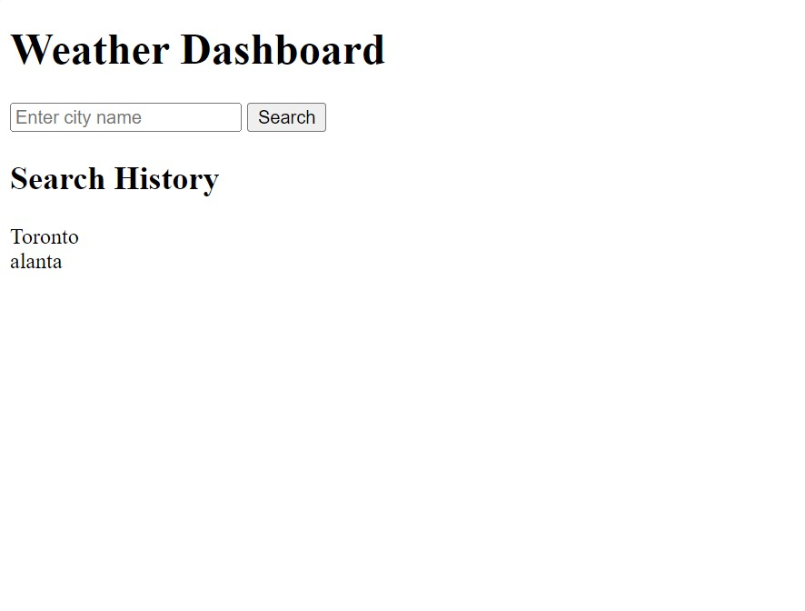

# Weather Dashboard

## Overview

The Weather Dashboard is a web application that provides users with current weather conditions and a 5-day weather forecast for multiple cities

## Features

- Search for weather information in multiple cities.
- View current weather conditions, including temperature, humidity, and wind speed.
- Get a 5-day weather forecast with date, weather icon, temperature, humidity, and wind speed details.
- Easily access previous search history.

## Usage

1. Enter a city name in the input field at the top of the page.
2. Click the "Search" button to retrieve weather data for the entered city.
3. The current weather conditions, including temperature, humidity, and wind speed, will be displayed in the "Current Weather" section.
4. The 5-day weather forecast for the city will be displayed in the "5-Day Forecast" section.
5. The search history will appear in the "Search History" section. You can click on a city in the search history to view its weather data again.

## Technologies

The Weather Dashboard is built using the following technologies:

- HTML
- JavaScript
- OpenWeatherMap API
- Local Storage for data persistence
